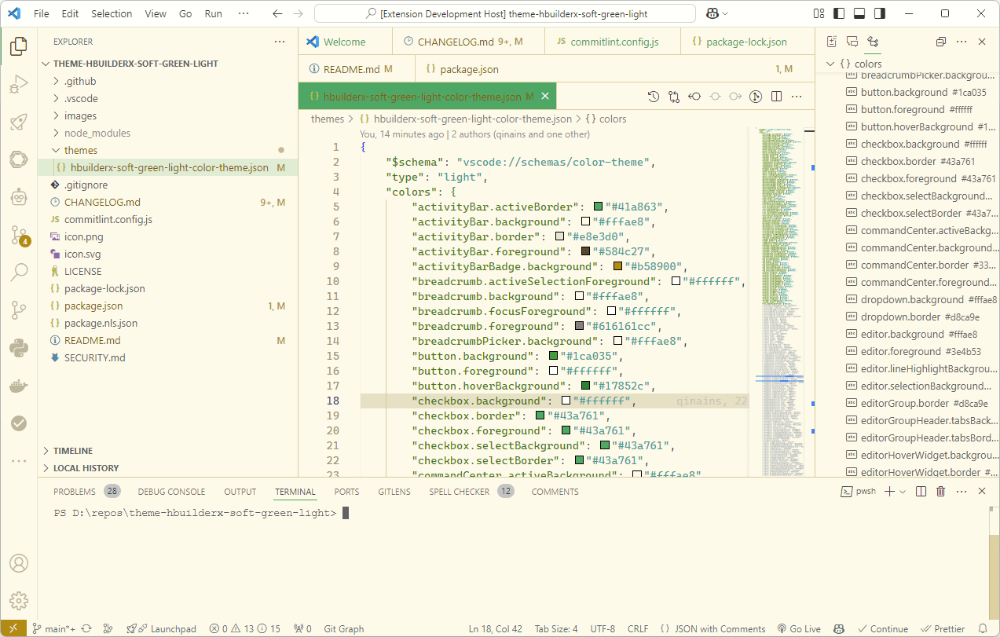

# HBuilderX Soft Green

A soft green theme family for VS Code and Zed, with light and dark variants.



## Editors

### VS Code

The VS Code extension lives in [`vscode/`](vscode/).

```bash
cd vscode
npm install
npm run compile
npm run package
```

Install it from the
[VS Code Marketplace](https://marketplace.visualstudio.com/items?itemName=lninl.theme-hbuilderx-soft-green-light).

### Zed

The Zed extension lives in [`zed/`](zed/) and provides:

- `HBuilderX Soft Green Light`
- `HBuilderX Soft Green Dark`

For local development, run `zed: install dev extension` and select `zed/`.

Validate the Zed theme from the repository root:

```bash
cd vscode
npm run test:zed
```

To follow the operating system appearance automatically:

```json
{
  "theme": {
    "mode": "system",
    "light": "HBuilderX Soft Green Light",
    "dark": "HBuilderX Soft Green Dark"
  }
}
```

## License

MIT
